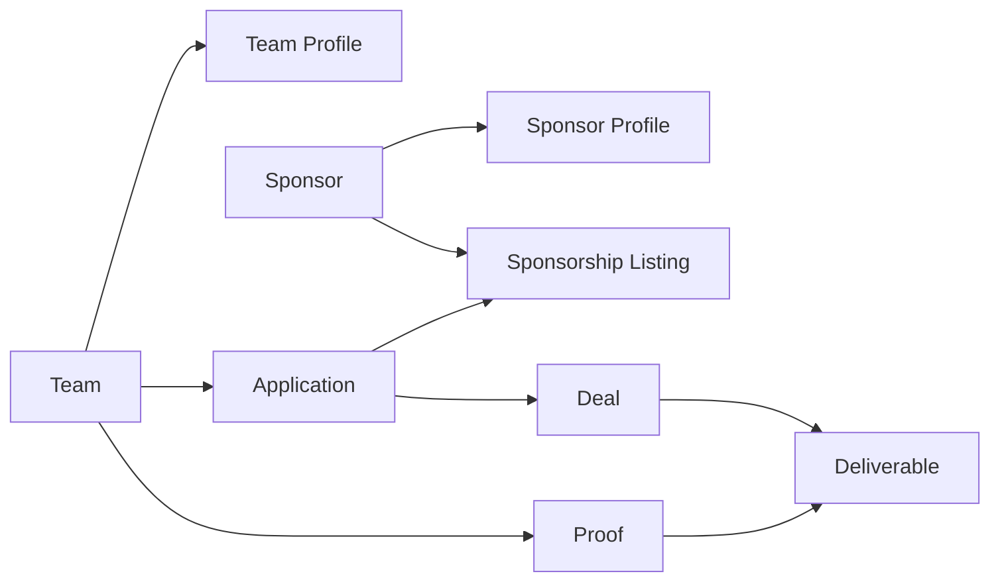

# Domain Model

**Status:** Canonical
**Owner:** Brian + Joshua
**Last reviewed:** 2026-05-24
**Source:** [Domain Glossary](../domain-glossary.md), [MVP Overview](./mvp-overview.md), [UX Walkthrough](./ux-walkthrough.md)
**Use this for:** Conceptual MVP entities, relationships, and lifecycle language before implementation.

Back to [Documentation Hub](../README.md).

## Summary

This page defines the MVP domain model at the product level. It is not a final database schema. Use it to align product specs, UI flows, engineering tickets, and early data modeling.

## Core Relationship

## MVP Entities

| Entity | Definition | Owned by | MVP purpose |
| --- | --- | --- | --- |
| Team | A college club sports organization seeking sponsorship support. | Team officers | Create a trusted supply of sponsor-ready teams. |
| Team Profile | The standardized public/team-facing representation of a team. | Team | Let sponsors compare teams consistently. |
| Sponsor | A company or organization that can support teams. | Sponsor contacts | Create a trusted source of sponsorship opportunities. |
| Sponsor Profile | The standardized representation of a sponsor and its brand identity. | Sponsor | Help teams judge fit and legitimacy. |
| Sponsorship Listing | An opportunity created by a sponsor. | Sponsor | State offer, criteria, timeline, and expected assets. |
| Application | A team's submission to a listing. | Team | Give sponsors a comparable applicant review queue. |
| Deal | An accepted sponsorship relationship. | Team + Sponsor | Track post-acceptance coordination and delivery. |
| Deliverable | A promised action or asset within a deal. | Team + Sponsor | Make expectations explicit. |
| Proof | Evidence that a deliverable was completed. | Team | Help sponsors verify value delivered. |
| Contact | A person tied to a team, sponsor, or pipeline lead. | Team, Sponsor, or Spontus | Preserve relationship context across handoffs. |

## MVP Lifecycles

### Team Profile

Draft -> Submitted for verification -> Verified

Exception states: Needs changes, Suspended.

### Sponsor Profile

Draft -> Submitted for verification -> Verified

Exception states: Needs changes, Suspended.

### Sponsorship Listing

Draft -> Open -> Closed

Optional MVP state: Paused.

### Application

Draft -> Submitted -> Under review -> Accepted or Declined

Optional MVP state: Withdrawn.

### Deal

Pending kickoff -> Active -> Completed

Exception state: Canceled.

### Deliverable And Proof

Not started -> In progress -> Submitted -> Approved

Exception state: Needs revision.

## MVP Relationship Rules

- A team owns one active team profile for MVP.
- A sponsor owns one sponsor profile for MVP.
- A sponsor can create many sponsorship listings.
- A team can submit many applications, but only one application per listing.
- An accepted application creates one deal.
- A deal contains one or more deliverables.
- A team can submit proof against each deliverable.
- Spontus can manually verify teams, sponsors, and listings before they become visible.

## Out Of Scope For This Model

- Final database table names, IDs, indexes, and constraints.
- Payment, escrow, invoicing, and tax handling.
- Automated matching weights.
- Multi-brand sponsor portfolios.
- Complex permissions across multiple officers or sponsor departments.
- Full CRM behavior beyond basic contacts and pipeline context.

## Related Docs

- [Domain Glossary](../domain-glossary.md)
- [MVP Build Slices](./mvp-build-slices.md)
- [MVP Overview](./mvp-overview.md)
- [Development Readiness](../engineering/development-readiness.md)
- [Decision Log](../decision-log.md)
